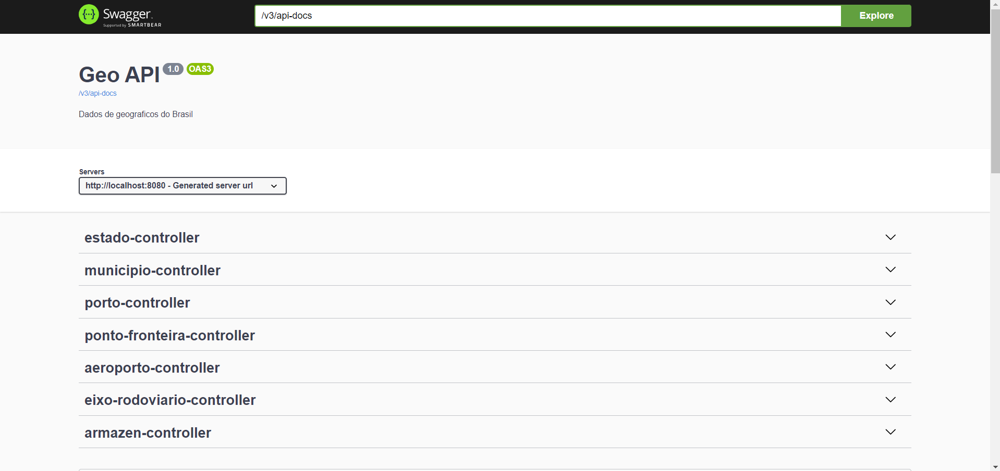

<h1 align="center">GeoSpringBootAPI</h2>

<p align="center">
  
</p>

## 📌 Sobre:
Esta aplicação foi desenvolvida para aplicar os conhecimentos adquiridos na disciplina de Banco de Dados 2, com foco em bancos de dados geográficos. Utilizamos dados do IBGE de 2014, incluindo informações sobre municípios, estados, aeroportos, portos, entre outros. A aplicação tem como objetivo integrar e manipular esses dados geográficos, proporcionando uma ferramenta robusta para análises espaciais e geográficas.

## 丘멦echs:


## 📖 Documentação:
Para acessar a documentação da api com swagger-ui.
```
http://localhost:8080/swagger-ui/index.html#/
```
# postgisSpringBootAPI
